# Vol.001 焦電センサー

## 準備するもの

### 必須

* [Vol.000 でセットアップした Raspberry Pi](../vol000-raspberrypi-setup/README.md)
* [焦電センサ（SB412A）](http://akizukidenshi.com/catalog/g/gM-09002)
* [PiCamera](https://www.amazon.co.jp/dp/B01D1D0DJ0)
* LED
* 抵抗
  * [100Ω x 1個](http://akizukidenshi.com/catalog/g/gR-25101)
  * [150Ω x 1個](http://akizukidenshi.com/catalog/g/gR-25151)
  * [10kΩ x 1個](http://akizukidenshi.com/catalog/g/gR-25103)
* NPN型トランジスタ [2SC1815](http://akizukidenshi.com/catalog/g/gI-04268)
* ジャンパワイヤ
  * [オスーメス 適量](http://akizukidenshi.com/catalog/g/gC-08932)
  * [オスーオス 適量](http://akizukidenshi.com/catalog/g/gC-05371)


### 任意

* モバイルバッテリ（離れた場所に Raspberry Pi を置く場合）


### PC環境

* Slack アカウント


## 体験会

キーボード、マウス、ディスプレイを RaspberryPi に接続せず、開発していきましょう！


### 練習1 電子工作してみよう

* Raspberry Pi を3.3Vの電源として電子回路を動作させます。

* Raspberry Pi に micro SDカード が挿してあること確認して、USB電源をつないでください。


#### 焦電センサの動作

「人を検知したら LED が光る」という単純な回路を作成してみましょう。1本配線を間違えただけで、焦電センサやトランジスタが発熱して故障することがあります。故障防止のため、**電源（3.3V）と GND を接続する前** に配線を確認して、必要があればスタッフに相談してください。

こちらの回路図や完成図を見ながら、作成していきます。

**＊注意点** 電源（3.3V）と GND は、まず GND をつないでから電源（3.3V）をつなぐようにしてください。


**【回路図】**

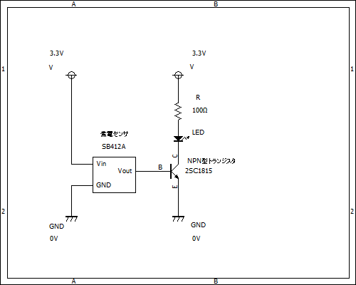


**【完成図】**


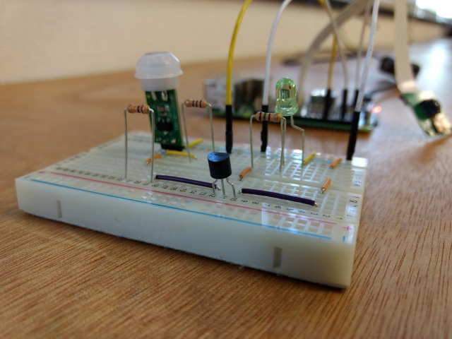


#### 仕組み

* 焦電センサが人（赤外線）を検知する
* 焦電センサの Vout が High になる
* トランジスタが on となり、LED が点灯する

焦電センサの[データシート](http://akizukidenshi.com/catalog/g/gM-09002)を確認してみましょう。「電源電圧（Vdd）: 3.3V～12V、出力: 検出時（High）3V」とあります。

Raspberry Pi のピンヘッダには 3.3V と 5V の電源出力ピンがあります。今回は、3.3V の電源出力ピンを焦電センサの電源として使用します。焦電センサからは3本のピンヘッダが出ています。真ん中は出力ピン Vout です。

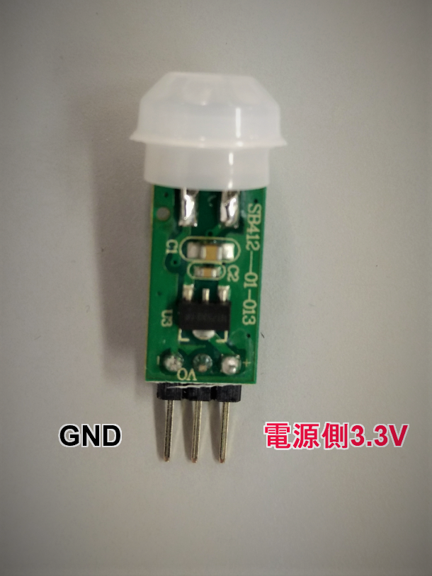

NPN型トランジスタからは、足が3本出ています。それぞれに役割があり、正しく配線しないと動作しません。トランジスタから出ている3本の足は、それぞれベース、コレクタ、エミッタです。

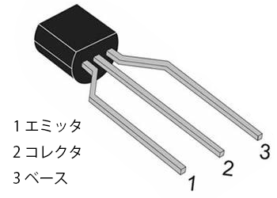

Raspberry Pi の各 GPIO の説明は以下を参照してください。
https://pinout.xyz


**【GPIO（汎用入出力）のピン配置】**

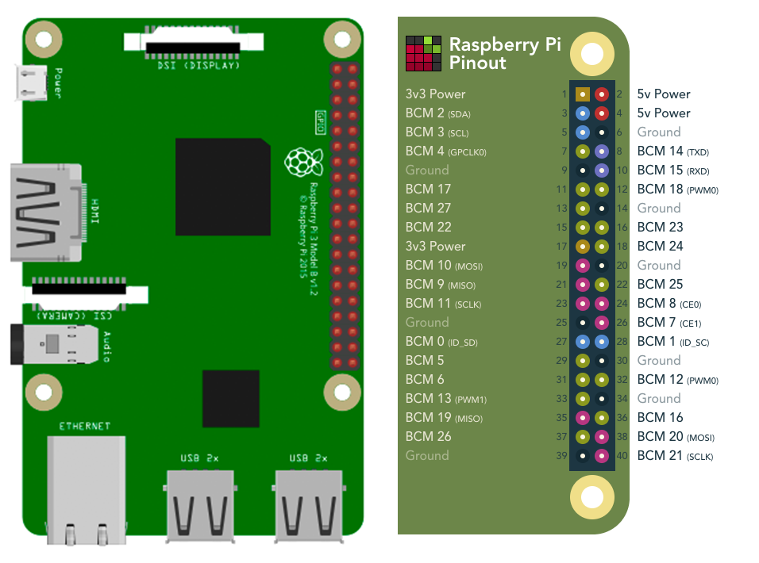

人を検知した場合、Vout が High となり 3V が出力されます。人を検知してから、一定時間後に Vout は Low となります。（High となる時間はセンサーに付いているボリュームで調整可能）


**【センサー反応のタイミングチャート】**


<!-- コメントアウト
作成ツール: https://rawgit.com/osamutake/tchart-coffee/master/bin/editor-offline.html

手 _存在しない_____~存在する~~~~~~~~~_存在しない______________
Vout ______~~~~~~~~~~~~~~~~~~~~_____
GPIO =0=====X=1==================X=0===
-->


**【回路の仕組み】**

データシートにあるように、Vout は焦電センサの基板上の 20kΩ の抵抗を介して出力されているので、オームの法則より、約100μA の電流が出力されます。

この程度の電流では LED が明るく光らないため、NPN型トランジスタで増幅します。NPN型トランジスタのベース端子に焦電センサの出力電流が流れ込むことにより、トランジスタが on となりコレクタ端子とエミッタ端子が導通して、LED に電流が流れるようになります。トランジスタの増幅作用により、LED にはベース端子に流れ込む電流の約100倍がコレクタ端子からエミッタ端子に流れます。

正しく動作すると、以下のように手や顔を近づけるとLEDが光ります。


### 練習2 Raspberry Pi で焦電センサの出力状態を取得してみよう

LED を光らせる代わりに、Raspberry Pi の GPIO を用いて焦電センサの出力状態（High、 Low）を読み取ってみましょう。


#### Raspberry Pi を起動する

Raspberry Pi が起動したら、ターミナルソフトで Raspberry Pi にログインします。

**【ログイン情報】**

```
IPアドレス: Raspberry Piのケースに貼り付けてあるラベル
ユーザー名: pi
パスフレーズ: raspberry
```

WindowsでTeraTermを使う場合、TeraTerm を起動すると下記のような画面が現れるので、ログイン情報を見ながら IPアドレスを入力します。

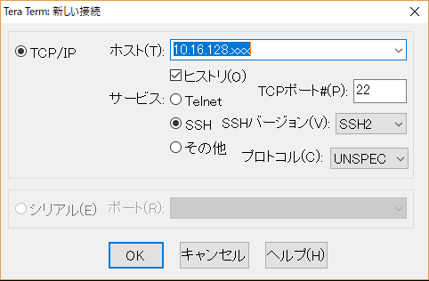

OK を押下すると、以下の画面が表示されるので、Raspberry Pi のデフォルトのユーザー名とパスフレーズを入力します。

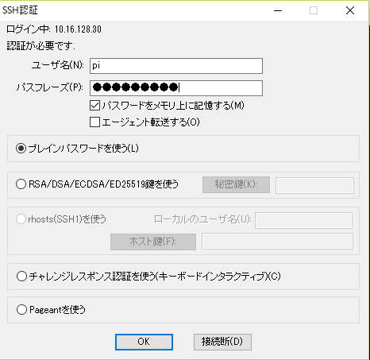

ログインに成功すると、以下の画面が表示されます。

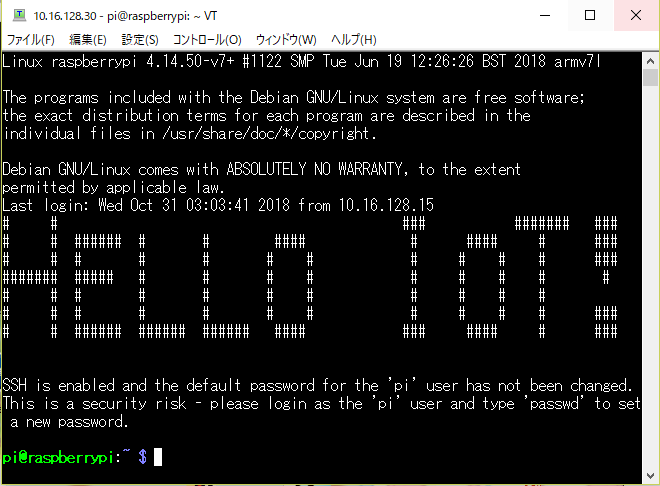


#### 電子回路を作成する

以下の実体配線図を見ながら、つないでみてください。正しく配線しないと正しく動作しないので、注意深く配線してください。

故障防止のため、**電源（3.3V）と GND を接続する前** に配線を確認して、必要があればスタッフに相談してください。

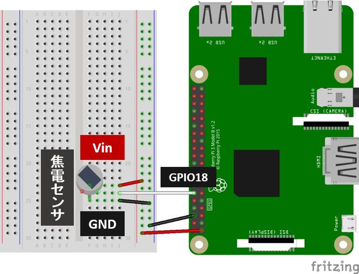


#### GPIO の状態を読み取る

焦電センサの出力状態（High、Low）を GPIO で読み取るソースコードを GitHub から取得します。

Raspberry Pi で、以下のコマンドを実行しましょう。

```
$ git clone https://github.com/cami/IoT-Hands-on.git
```

取得したディレクトリの中の、vol001-pyroelectric-sensor というディレクトリに移動します。

Raspberry Pi で、以下のコマンドを実行しましょう。

```
$ cd ~/IoT-Hands-on/vol001-pyroelectric-sensor
```

このディレクトリの中に、`motion_sensor.py` という Python ファイルがありますので、実行してください。

[ソースコード](./motion_sensor.py)

```
$ python3 motion_sensor.py
```

成功すれば、人を検知すれば 1、検知しなければ 0 が表示されます。

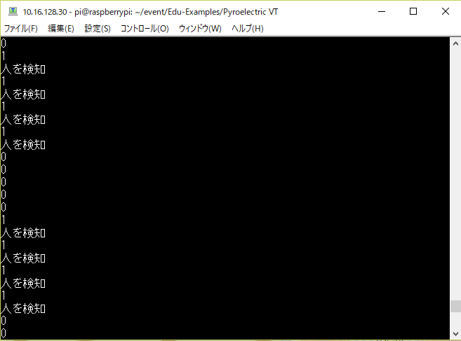


### 練習3 人を検知したら写真を撮影して Slack に送信しよう

最後に、人を検知したら写真を撮影することで、防犯カメラの役割を与えましょう。今回は通知と閲覧を容易にするために、Slack に写真を送信します。


#### PiCamera を RaspberryPi に接続する

写真を撮影するために、PiCamera を Raspberry Pi に接続しましょう。Raspberry Pi の終了処理を行い、電源外してから、PiCamera を接続します。

Raspberry Pi で、以下のコマンドを実行しましょう。

```
sudo shutdown -h now
```

緑色の LED が点滅状態から消灯するのを待ってMicroUSBコネクタを抜いてください。

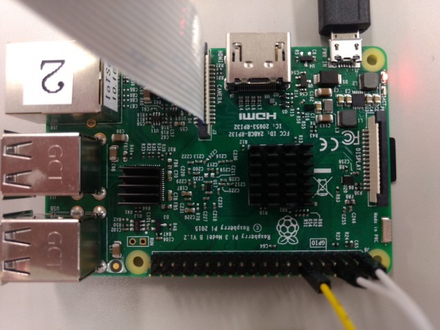


次は、いよいよ Pi Camera を Raspberry Pi に接続します。写真の赤丸にある茶色のツメを上に引き上げてから、フラットケーブルを差し込み、ツメを押し下げます。フラットケーブルの向きは接点がHDMIコネクタ側です。コネクタは壊れやすいので気を付けてください。


#### Slack API の Token を設定する

撮影した写真を Slack に投稿するために、Slack API の Token を設定します。スタッフが Token を配布します。

ご自分のSlackを使いたい場合は以下のページを参考に Token を発行してください。Permission Scope には`files.upload` を追加してください。

https://qiita.com/ykhirao/items/3b19ee6a1458cfb4ba21

Raspberry Pi で以下のコマンドを実行して、Pythonファイルを編集します。

```
$ nano ~/IoT-Hands-on/vol001-pyroelectric-sensor/motion_detected_send_slack.py
```

18行目の以下の行で、`xoxp-`を配布したTokenに置き換えます。

```python
'token': "xoxp-",
```


#### 電子回路を作成する

こちらの回路図を見ながら作成してみてください。

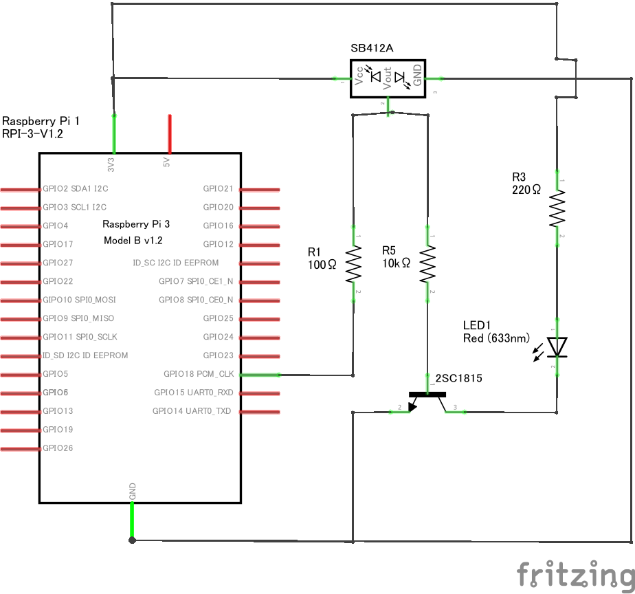

ブレッドボードへの配線は下記の通りになります。

故障防止のため、**電源（3.3V）と GND を接続する前** に配線を確認して、必要があればスタッフに相談してください。

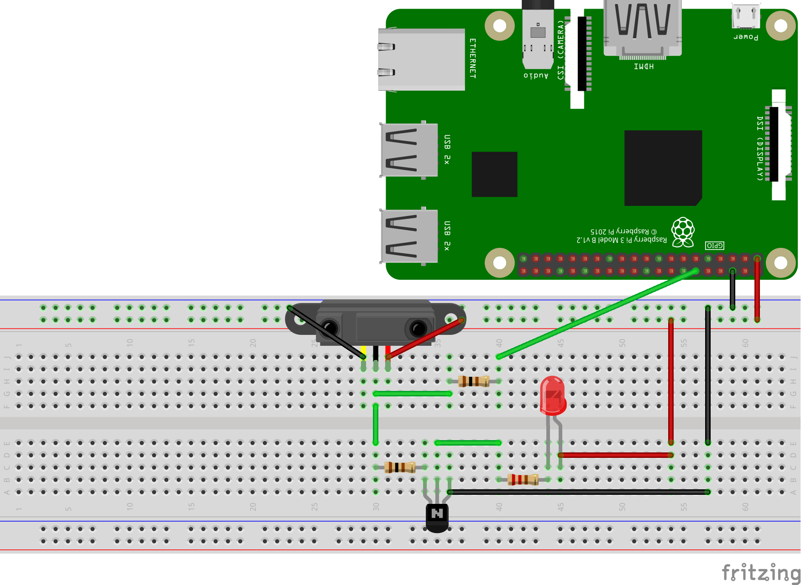


#### 防犯カメラを起動する

vol001-pyroelectric-sensor というディレクトリに移動します。Raspberry Pi で、以下のコマンドを実行しましょう。

```
$ cd ~/IoT-Hands-on/vol001-pyroelectric-sensor
```

このディレクトリの中に、`motion_detected_send_slack.py` という Python ファイルがありますので、実行してください。

[ソースコード](./motion_detected_send_slack.py)

```
$ python3 motion_detected_send_slack.py
```

人を検知したら Slack に写真が送られるはずです。

こちらのチャンネル [# security-camera](https://camico-kousaku-01.slack.com/messages/CDSC8F066/) で確認してみましょう！


Slack への通知が完了したら、Slack API の API リファレンスを参照しながら、Slack へのアップロードをカスタマイズしてみましょう。

[Slack API files.upload](https://api.slack.com/methods/files.upload)
