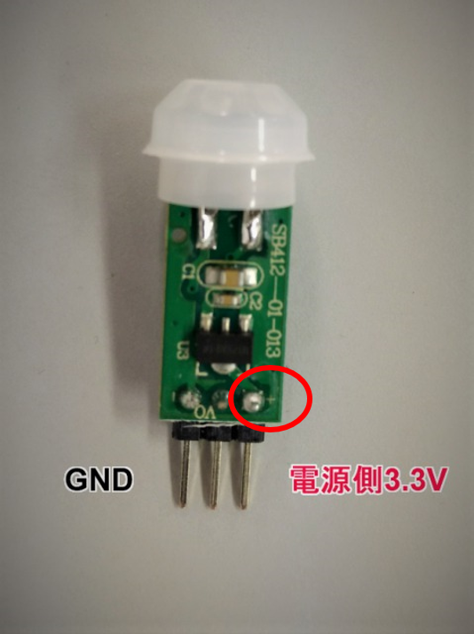
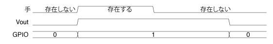

### 仕組み

#### 焦電センサ

* 焦電センサが人（赤外線）を検知する
* 焦電センサの Voutが Highになる
* トランジスタが onとなり、LEDが点灯する

まず、焦電センサを Raspberry Piの GPIO(汎用入出力)に接続します。

焦電センサの3本のピンの役割を[データシート](http://akizukidenshi.com/download/ds/senba/SB412A.pdf)を見て確認します。

"Features and Electrical Specification" のところに「電源電圧（Vdd）: 3V～12V、出力: 検出時（High）3V」とあります。

これで、Raspberry Piから 3.3Vの電源を焦電センサに供給すればよいことがわかりました。

それでは、Raspberry Piの
[GPIOのピン配置](./docs/pinout.png)
を見て、3.3Vの電源を探しましょう。

ピン番号`1番` のところに、`3V3 Power` とあります。

3.3Vの出力があるということなので、`1番ピン` から焦電センサに電源を供給すればよいですね。

焦電センサからは3本のピンが出ており、写真のように拡大すると、

赤丸で囲んだように、`+` が書いてあるはずです。

`+` と書いてあるピンが入力ピン Vin(3.3V)であり、真ん中が出力ピン Vout、残りのピンが GNDピンです。

Raspberry Piの各GPIOの説明は以下を参照してください。
https://pinout.xyz

#### NPN型トランジスタ

NPN型トランジスタからは足が3本出ており、それぞれベース、コレクタ、エミッタと呼ばれています。

役割としては、焦電センサが人を検知したとき(HIGHになったとき)に出力される µAオーダーの微小電流を増幅させて LEDを光らせることです。

人を検知してから、一定時間後に Voutは Lowとなります(つまり、微小電流が出力されなくなり、LEDが消灯する)。

Highとなる時間はセンサーに付いているボリュームで調整可能です。

**【センサー反応のタイミングチャート】**

<!-- コメントアウト
作成ツール: https://rawgit.com/osamutake/tchart-coffee/master/bin/editor-offline.html

手 _存在しない_____~存在する~~~~~~~~~_存在しない______________
Vout ______~~~~~~~~~~~~~~~~~~~~_____
GPIO =0=====X=1==================X=0===
-->

#### 電子回路

データシートにあるように、Voutは焦電センサの基板上の 20kΩの抵抗を介して出力されています。

オームの法則より、約100µAの電流が出力されます。

この程度の電流では LEDが明るく光らないため、NPN型トランジスタで増幅します。

NPN型トランジスタのベース端子に焦電センサの出力電流が流れ込むことにより、トランジスタが onとなりコレクタ端子とエミッタ端子が導通して、LEDに電流が流れるようになります。

トランジスタの増幅作用により、LEDにはベース端子に流れ込む電流の約100倍がコレクタ端子からエミッタ端子に流れます。

正しく動作すると、焦電センサに手や顔を近づけるとLEDが光ります。
