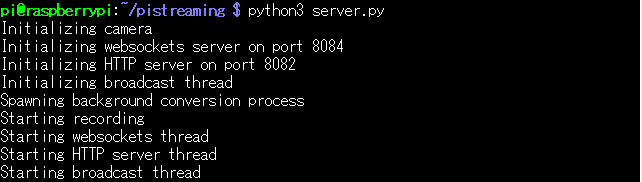
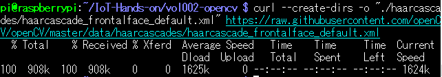
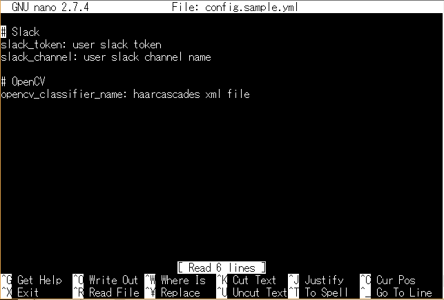

# Vol.002 OpenCVで画像処理


## 準備するもの


### 必須

* [Vol.000でセットアップしたRaspberry Pi](../vol000-raspberrypi-setup/README.md)
（体験会では既にご用意しております。）
* [Vol.001で作成した電子回路](../vol001-pyroelectric-sensor/README.md)
* [PiCamera](https://www.amazon.co.jp/dp/B01D1D0DJ0)


#### PC環境

### 任意

* モバイルバッテリ（離れた場所に Raspberry Piを置く場合）
* Slackアカウント


## 体験会

### 今回やること

**OpenCVを用いた、人物判定システム** の作成。

vol001で撮影した写真を OpenCVで分析することで、撮影した動体が人物かどうかを判定します。

その判定結果を Slackに通知しましょう。

* 練習1「PiCameraの映像をストリーミング再生します」

* 練習2「OpenCVを実装します」

* 練習3「システムを作動させて人物判定を行います」

* 発展課題1「動体を検知したら、イベント録画をしましょう」


### 練習1「PiCameraの映像をストリーミング再生します」

いよいよ、本体験会の醍醐味である人物判定に進みます。


#### 「ストリーミング再生に必要なパッケージのインストール」

PiCameraで撮影している映像をブラウザでストリーミング再生して、動画を撮影できることを確認します。

以下のコマンドを Raspberry Piで実行して、必要なパッケージをインストールします。

```
$ sudo apt -y install ffmpeg python3-picamera python3-ws4py
$ git clone https://github.com/waveform80/pistreaming.git ~/pistreaming
```


#### 「ブラウザでストリーミング再生」

アプリを実行します。

```
$ cd ~/pistreaming
$ python3 server.py
```

インストールに成功していれば、このように表示されますので、



ご自身のブラウザで

`http://[Raspberry PiのIPアドレス]:8082/index.html`

にアクセスしてみましょう！

PiCameraで撮影している映像がリアルタイムでストリーミングされているはずです。

アプリを終了させるには Raspberry Piのコマンドラインで、`Ctrl` + `C` を同時に押下します。


### 練習2「OpenCVを実装します」

人物かどうかを判定するために、今回は顔検出を行います。


#### OpenCVのインストール

[OpenCV 公式ドキュメント](https://docs.opencv.org/3.4.3/d7/d8b/tutorial_py_face_detection.html) をもとに実装していきます。

顔検出の詳しい解説は論文等に譲り、割愛させていただきます。
(参照=> [Face Recognition with OpenCV](https://docs.opencv.org/3.4.3/da/d60/tutorial_face_main.html))

OpenCVで使用するライブラリをインストールします。

インストールするライブラリを記載したシェルスクリプトを配置しているディレクトリに移動します。

```
$ cd ~/IoT-Hands-on/vol002-opencv/
```

ディレクトリの中には、下記のファイルやディレクトリがございます。


シェルスクリプトを実行して、ライブラリをインストールします。

```
$ bash setup.sh
```

インストールが開始されます。


#### 分類器の準備

今回の顔検出では、学習済みの [分類器](https://github.com/OpenCV/OpenCV/blob/master/data/haarcascades/haarcascade_frontalface_default.xml) を使用します。

`curl` コマンドで、分類器を Raspberry Piに直接ダウンロードしましょう。

curlの [公式ドキュメント](https://github.com/curl/curl/tree/master/docs/cmdline-opts) より、

```
$ curl --create-dirs -o "./haarcascades/haarcascade_frontalface_default.xml" https://raw.githubusercontent.com/openCV/openCV/master/data/haarcascades/haarcascade_frontalface_default.xml
```

と実行することで、



`vol002-opencv` 配下に分類器を保存できました。


### 練習3「システムを作動させて人物判定を行います」

#### YAMLファイルの編集

Slackの認証情報とOpenCVで用いる分類器を使用するために、YAMLファイルを編集しましょう。

YAMLファイル `config.sample.yml` を nanoコマンド等で開いて、【設定情報】のように3箇所ほど編集します。

```
$ nano config.sample.yml
```



**【設定情報】**
```
# Slack
slack_token: # Slackの generalチャンネルに貼ってある "xoxp-"で始まる文字列
slack_channel: 'security-camera'

# OpenCV
opencv_classifier_name: './haarcascades/haarcascade_frontalface_default.xml'
```

`slack_token` はご招待した Slackのワークスペースの `general` チャンネルに記載してあります。

vol001と同じ手順で `config.yml` とファイル名を変更して保存します。


#### システムの作動

それでは、準備が整いましたので、ソースコードを実行して、動作を確認してみましょう！

```
python3 main.py
```

成功すれば、動体を検知すると写真を撮影し、人物判定を行った後に、Slackに通知を送信します。
