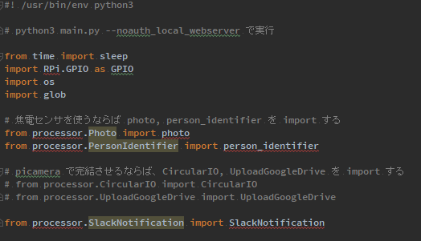

# Vol.002 Raspberry Pi で監視カメラを作ろう

## 1．準備するもの

### 必須

* [Vol.000でセットアップしたRaspberry Pi](../vol000-raspberrypi-setup/README.md)
(体験会では既にご用意しております。)
* [PiCamera](https://www.amazon.co.jp/dp/B01D1D0DJ0)


### 任意

* モバイルバッテリ（離れた場所にRaspberry Piを置く場合）


### PC環境

* Slackアカウント


## 2. 体験会

### 今回やること

1. **焦電センサを用いた、動体検知システム** の作成
2. **PiCameraを用いた、人物判定システム** の作成

Part1→ Part2 の順番で作成していく必要があります。

Part1 に関しては、簡単な電子回路を組む必要があり、[vol001](../vol001-pyroelectric-sensor/README.md) をご覧ください。

本稿では、Part2 の「動体を検知したら PiCamera で写真を撮影して、人物かどうかを判定するシステム」の作成手順をご紹介します。

Windows での作成手順を記載しておりますので、Mac 等をご使用の方はスタッフまでお気軽にお声がけください。

＊　ソースコードを編集すれば、vol001 の動体検知システムは作成する必要はありませんが、せっかくのIoT体験会なので、センサーから情報を取得するために vol001 のシステムの作成から始めましょう。


### 練習1「カメラの映像を見てみよう」

いよいよ、本体験会の醍醐味である人物判定に進んでいきましょう。

#### PiCamera の準備

まずは PiCamera を装着します。

装着方法は、
[こちら](https://github.com/cami/IoT-Hands-on/blob/feature/vol002/vol001-pyroelectric-sensor/README.md#picamera-%E3%82%92-raspberrypi-%E3%81%AB%E8%A3%85%E7%9D%80%E3%81%99%E3%82%8B)
をご覧ください。

次に、PiCamera で撮影している映像をストリーミング再生してみましょう。

以下のコマンドを Raspberry Pi で実行して、必要なパッケージをインストールします。

```
$ sudo apt -y install ffmpeg python3-picamera python3-ws4py
$ git clone https://github.com/waveform80/pistreaming.git ~/pistreaming
$ cd ~/pistreaming
```

#### ブラウザでストリーミング再生

アプリを実行します。

```
$ python3 server.py
```

インストール等が成功していれば、下記のメッセージが表示されます。

```
Initializing camera
Initializing websockets server on port 8084
Initializing HTTP server on port 8082
Initializing broadcast thread
Spawning background conversion process
Starting recording
Starting websockets thread
Starting HTTP server thread
Starting broadcast thread
```

それでは、ご自身のブラウザで

`http://[Raspberry PiのIPアドレス]:8082/index.html`

にアクセスしてみましょう！

正しくインストールされていれば、PiCamera で撮影している映像がリアルタイムでストリーミングされているはずです。

アプリを終了させるには Raspberry Pi のコマンドラインで、`Ctrl` + `C` を同時押しします。


### 練習2「人物判定システムを構築しよう」

焦電センサで動体を検知したら、PiCamera で写真を撮影して openCV で人物かどうかを判定し、その結果を Slack に通知するシステムを構築します。

人物かどうかを判定するために、顔検出を行います。

#### openCV のインストール

今回は、
[openCV 公式ドキュメント](https://docs.opencv.org/3.4.3/d7/d8b/tutorial_py_face_detection.html)
をもとに実装していきます。

顔検出の詳しい解説は論文等に譲り、割愛させていただきます。
(cf. [Face Recognition with OpenCV](https://docs.opencv.org/3.4.3/da/d60/tutorial_face_main.html))

本日は事前に環境構築を済ませてありますが、openCV を Raspberry Pi にインストールする必要があります。

手順は
[openCV 公式ドキュメント](https://docs.opencv.org/3.4.3/d7/d9f/tutorial_linux_install.html)
にある通り、
```
sudo apt install -y build-essential
sudo apt install -y cmake git libgtk2.0-dev pkg-config libavcodec-dev libavformat-dev libswscale-dev
sudo apt install -y python-dev python-numpy libtbb2 libtbb-dev libjpeg-dev libpng-dev libtiff-dev libjasper-dev libdc1394-22-dev
```
このように行います。

#### 分類器の準備

今回は、顔検出のために、学習済みの
[分類器](https://github.com/opencv/opencv/blob/master/data/haarcascades/haarcascade_frontalface_default.xml)
を使用します。

まずは、分類器をダウンロードします。

`curl` コマンドで、Raspberry Pi に直接ダウンロードしましょう。

curl の
[公式ドキュメント](https://github.com/curl/curl/tree/master/docs/cmdline-opts)
より、

```
curl --create-dirs -o "./haarcascades/haarcascade_frontalface_default.xml" https://raw.githubusercontent.com/opencv/opencv/master/data/haarcascades/haarcascade_frontalface_default.xml
```

と実行することで、


`vol002-surveillance-camera` 配下に分類器を保存できました。


#### システムの作動

vi エディター、もしくは nano エディターにて、`main.py` の中を確認してみましょう。

```
vi main.py
```

練習2では CircularIO, UploadGoogleDrive は import しません。



このようにライブラリを読み込んでいれば、うまく動作するはずです。

```
python3 main.py
```

`main.py` を実行すると、動体を検知すると写真を撮影し、openCV で人物の顔かどうかを判定し、Slack にその結果と写真を通知してくれます。

openCV による判定は、`./processor/PersonIdentifier` 内の `person_identifier 関数` にて行っています。

14行目の `scaleFactor`, `minNeighbors` の値によって、精度が変わりますので、
[こちらの記事](https://qiita.com/FukuharaYohei/items/ec6dce7cc5ea21a51a82)
を参考しながら、いろいろと試してみてください。


### 発展課題1「動体を検知したら、イベント録画をしよう！」

vol001 も vol002 の練習も終わったという方は、発展課題に移りましょう。

picamera の
[circularIO](https://picamera.readthedocs.io/en/latest/recipes1.html?highlight=Circular#recording-to-a-circular-stream)
を使って、イベント録画を行います。

このクラスを使えば、ドライブレコーダーのように、あるイベントを起点として、そのイベントの前後 n秒間を録画することができます。

あるイベントは、例えば、動体を検知したとき、揺れを検知したときなどがあります。

Python で Raspberry Pi の GPIO を制御するモジュールの RPi.GPIO には、
[event_detected() 関数](https://sourceforge.net/p/raspberry-gpio-python/wiki/Inputs/)
が用意されています。

この関数を用いて、「焦電センサで動体を検知した」のような起点となるイベントを検知します。


#### CircularIO.py を編集して、main.py から実行できるようにする

`vol002-surveillance-camera` には既に、`circularIO` のサンプルプログラムが用意してあります。

`main.py` と `CircularIO.py` を編集することによって、イベント録画を実現してみましょう！


#### Google Drive にファイルをアップロードする

撮影した動画は、`.h264` 形式で保存されます。

ディスプレイがないと Raspberry Pi では再生できませんので、`main.py` にはあらかじめ GoogleDrive にアップロードするようなコードが書かれています。

`main.py` を `vi` エディターで開くと、コメントアウトの指示が 5か所ありますので、指示を見ながら編集してください。

GoogleDrive にファイルをアップロードするには、
[API](https://developers.google.com/drive/api/v3/manage-uploads)
を使います。

OAuth2.0 認証が必要ですので、
[こちら](https://support.google.com/googleapi/answer/6158849?hl=en&ref_topic=7013279)
を見ながら認証してください。

手順に沿ってダウンロードした `credentials.json` を Raspberry Pi に SCP 通信で移動させます。

`credentials` ディレクトリを作成してから、移動させます。

```
@raspberrypi:~/IoT-Hands-on/vol002-surveillance-camera $ mkdir credentials
```

ここまで出来たら、あとは動画をアップロードする GoogleDrive のフォルダを指定するだけです。

```
https://drive.google.com/drive/[your_folder_id]
```

GoogleDrive の該当フォルダに移動して、URLを確認してください。

[your_folder_id] の部分でアップロード先のフォルダを指定することができます。

取得したIDで、`UploadGoogleDrive.py` の

```
FOLDER_ID = `your_folder_id`
```

を書き換えます。


#### イベント録画を起動し、撮影し動画をGoogleDriveにアップロードする

ここまで出来ましたら、あとは `main.py` を実行するだけです。

今回は、コマンドラインで認証を行うので、オプションをつける必要があります。

```
python3 main.py --noauth_local_webserver
```

指示通りに認証を完了させると、イベント録画が始まります。
